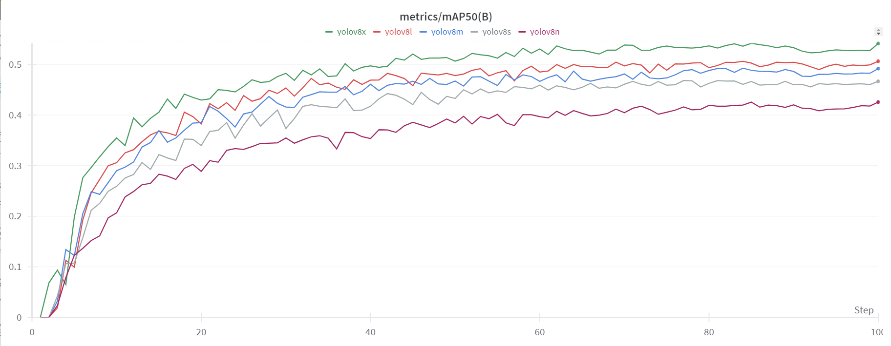
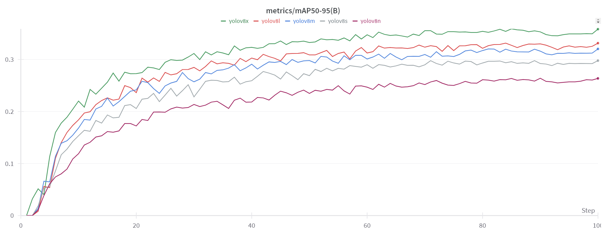
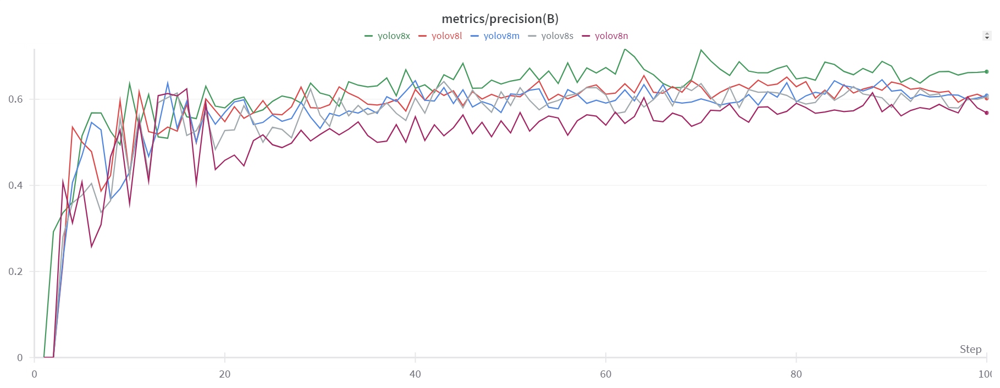
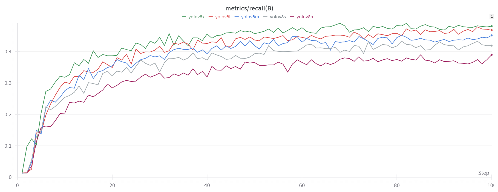

# Benchmarks

## Dataset 

Below models are trained on the SSLAD dataset and you can download the dataset from [here](https://soda-2d.github.io/).

## Benchmark Results

### 1. YOLOv8

Below models are trained from scratch using the hyperparameter described in the [yaml](https://github.com/myatthukyaw/detnets/blob/main/configs/yolo.yml) file. 

<table>
  <tr>
    <td>
mAP
</td>
    <td>
mAP50
</td>
  </tr>
  <tr>
    <td>
mAP
</td>
    <td>
mAP50
</td>
  </tr>
  <tr>
    
  </tr>
</table>

### We will try to provide the detailed benchmark results for all models.
